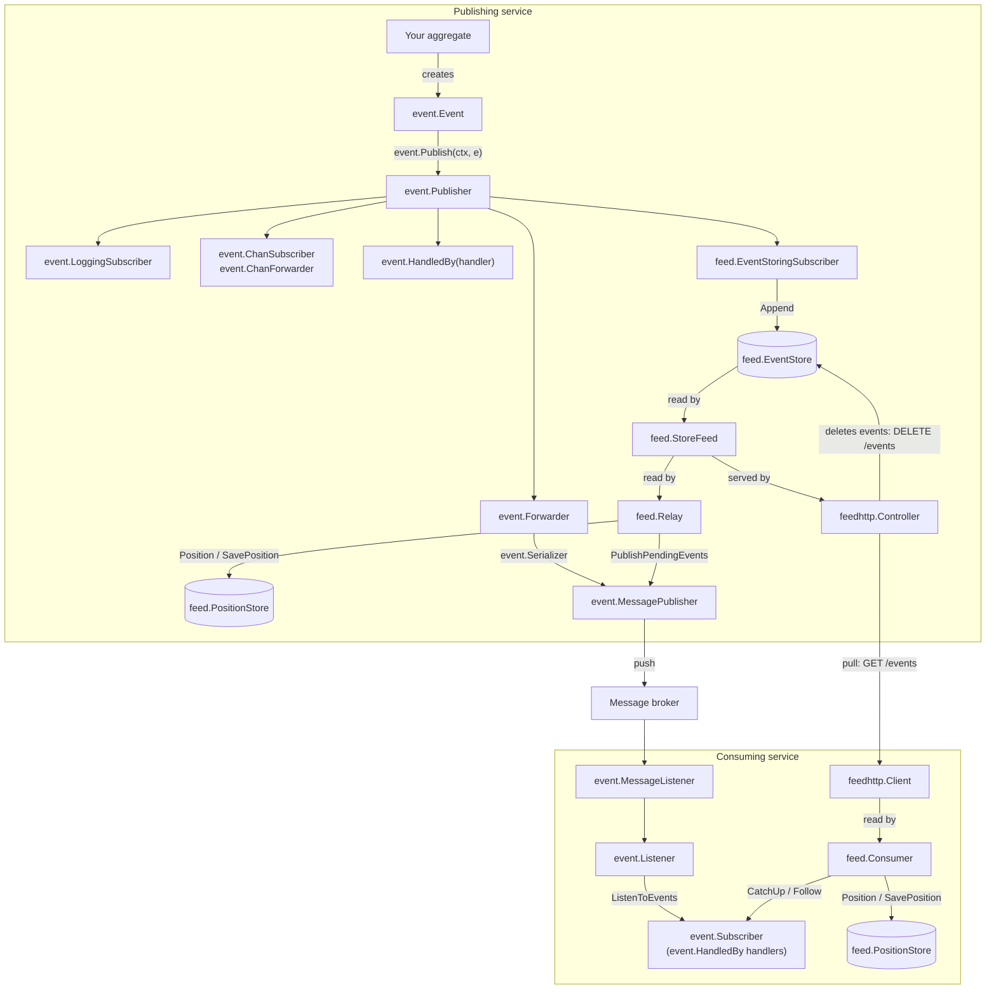

# go-eventide

[](https://github.com/grandper/go-eventide/actions/workflows/go-test.yml)
[](https://github.com/grandper/go-eventide/actions/workflows/go-lint.yml)
[](https://pkg.go.dev/github.com/grandper/go-eventide/event)
[](LICENSE)

`go-eventide` is a package that brings the *publish/subscribe* pattern for domain events to Golang:
events are published in a scope, carried up to the enclosing scopes, out to other services,
and into a durable feed.

**Main features:**

- Implementation of the *Publish-Subscribe* pattern in Golang, built on a single primitive: the event.
- Publishers carried by the `context.Context`, so you never thread them through your functions.
- Scopes that capture the events of a function call and let them rise to the enclosing scopes.
- Typed handlers (`event.Handle[T]`, `event.HandledBy[T]`) that fire only for the events of a given type, without type assertions.
- Ready-made subscribers: logging, channels, typed handlers, an internal-event filter, and a recorder for tests.
- Ready-made integrations for HTTP (`net/http` middlewares, usable with `gorilla/mux` or any other router) and gRPC (unary and stream server interceptors).
- Transport-neutral forwarding of events to other services, behind two small interfaces you can implement for any message broker.
- A pluggable serializer to carry events across the process boundary: any [go-serializer](https://github.com/grandper/go-serializer), with the codec of your choice (JSON, gob, Protocol Buffers, or your own).
- An event feed: an event store that consumers catch up with, over HTTP or in the process, and a relay that pushes it to a message broker (the outbox pattern).
- In-memory stores to get started and to write tests, behind small interfaces you implement for the database of your choice.
- Utilities to assert on the published events in tests.

**Contents:**
[Installation](#installation) ·
[What is Eventide?](#what-is-eventide) ·
[Main Concepts](#main-concepts) ·
[Usage](#usage) ·
[Event feed](#event-feed) ·
[Testing](#testing) ·
[Thread safety](#thread-safety) ·
[Errors](#errors) ·
[Package reference](#package-reference) ·
[Related repositories](#related-repositories) ·
[Examples](#examples) ·
[Development](#development)

## Installation

```bash
go get github.com/grandper/go-eventide
```
The library requires Go 1.25 or later.

Each package is imported on its own, so you only compile what you use:
```go
import (
	"github.com/grandper/go-eventide/event"             // events, publishers, scopes, subscribers
	"github.com/grandper/go-eventide/event/eventtest"   // assertions for your tests
	"github.com/grandper/go-eventide/event/middleware"  // a scope per HTTP request
	"github.com/grandper/go-eventide/event/interceptor" // a scope per gRPC call
	"github.com/grandper/go-eventide/feed"              // event store, feed, consumer and relay
	"github.com/grandper/go-eventide/feed/feedhttp"     // the feed over HTTP
	"github.com/grandper/go-eventide/feed/inmemory"     // in-memory stores
)
```
`event` and `feed` only depend on [`go-serializer`](https://github.com/grandper/go-serializer).
`gorilla/mux` comes with `feedhttp`, gRPC with `interceptor`, and `testify` and `protobuf`
with `eventtest`.

The Go module is `github.com/grandper/go-eventide` (the `go-` prefix matches the
sibling [`go-serializer`](https://github.com/grandper/go-serializer)), while the package you
import and call stays `event`: `event.Publish`, `event.Scope`, `event.NewPublisher`.

## What is Eventide?
Eventide helps
- decoupling the code that *makes something happen* from the code that *reacts to it*: an aggregate
  publishes an `OrderPlaced` event without knowing who logs it, stores it, or forwards it.
- keeping the plumbing out of your domain code: the publisher travels in the `context.Context`,
  so publishing an event is a one-liner wherever a context is available.
- making the events of a service available to other services, either pushed through a message
  broker or pulled from a feed.

### A first example
Here is a complete program. The domain code publishes an event without knowing who
listens, and the scope it runs in decides what happens to the event:
```go
package main

import (
	"context"
	"fmt"
	"time"

	"github.com/grandper/go-eventide/event"
)

type OrderPlaced struct {
	OrderID string
	At      time.Time
}

func (e OrderPlaced) OccurredOn() time.Time { return e.At }

// placeOrder is domain code: it publishes, and does not know who listens.
func placeOrder(ctx context.Context, orderID string) error {
	return event.Publish(ctx, OrderPlaced{OrderID: orderID, At: time.Now()})
}

func main() {
	event.PrivateScope(func(ctx context.Context) {
		_ = event.Handle(ctx, func(_ context.Context, e OrderPlaced) error {
			fmt.Println("order placed:", e.OrderID)
			return nil
		})

		if err := placeOrder(ctx, "42"); err != nil {
			fmt.Println("failed to place the order:", err)
		}
	}, event.NewLoggingSubscriber())
}
```
```
2026/09/26 10:00:00 INFO event published event=OrderPlaced
order placed: 42
```
The rest of this document takes these pieces one by one: the event, the publisher, the
scope and the subscribers, then what carries the events to other services.

### The name
**Eventide** is an ordinary English word — it means *evening*, the close of the
day — but read it as the library sees itself and it splits into **event + tide**.
Both halves say something true about what this library does.

**"event" — the unit everything is built on.** Eventide has exactly one primitive:
the domain event, a value that reports when it occurred (`OccurredOn() time.Time`).
Publishers emit events, subscribers handle events, the store keeps events, the
feed serves events. The name puts that primitive front and center — this is a
library *about events*, not about queues, topics, or transports (those are just
where the events happen to flow).

**"tide" — events move, in a direction, continuously.** A tide is not a splash;
it is a steady, directional flow that carries things along and, in time, deposits
them on the shore. Every part of Eventide is that flow:

- **Rising through scopes.** Events published in an inner scope propagate *upward*
  to the subscribers of every enclosing scope — like a tide rising through nested
  pools. A private scope is a tide pool cut off from the sea; a sub-scope lets its
  water flow out to the parent.
- **Flowing out of the process.** An `event.Forwarder` serializes events and carries them
  past the process boundary — through an `event.MessagePublisher` —
  to `event.Listener`s in other services. The tide reaches beyond your own shoreline.
- **Settling into a record.** At *eventide* — evening — the day's events settle.
  The `feed.EventStoringSubscriber` deposits everything that occurred into a
  `feed.EventStore`, an ordered, durable record of the day's happenings. Nothing the
  tide carried is lost; it is left on the shore in the order it arrived.
- **Carried onward, reliably.** From that record the feed moves events downstream
  a second way: a `feed.Consumer` *pulls* what happened since its last visit, and a
  `feed.Relay` *pushes* not-yet-published events to a broker and advances its position.
  Like the tide returning, it keeps going until everything past its position has
  reached where it needs to be.

So the whole shape of the library is in the name: **events** enter as the single
primitive, and a **tide** carries them — up through scopes, out to other services,
and into a durable record that is itself replayed onward. *Eventide* is where the
events of the day gather.

### Overview
The library is two main packages, `event` and `feed`, and a handful of types. Every box of
the diagram below is a type of the library or an interface you implement, named as
you find it in the code:
1. An `event.Event` reports that something occurred.
2. An `event.Publisher` delivers the events it publishes to its `event.Subscriber`s,
   synchronously and in order. Scopes (`event.Scope`, `event.PrivateScope`) own a
   publisher for the duration of a function call and carry it in the `context.Context`,
   so domain code publishes with `event.Publish(ctx, e)`.
3. Subscribers handle the events: `event.LoggingSubscriber` logs them,
   `event.ChanSubscriber` and `event.ChanForwarder` put them on a channel, `event.HandledBy`
   wraps a typed handler function, `feed.EventStoringSubscriber` appends them to a
   `feed.EventStore`, and `event.Forwarder` serializes them and hands them to an
   `event.MessagePublisher`.
4. An `event.Forwarder` in one service and an `event.Listener` in another carry events
   across the process boundary through a message broker. The broker hides behind the
   `event.MessagePublisher` and `event.MessageListener` interfaces, implemented by the
   adapter repositories or by you.
5. The feed replays the stored events: `feed.StoreFeed` reads the `feed.EventStore`,
   `feedhttp.Controller` serves it over HTTP (and deletes the events no longer needed)
   and `feedhttp.Client` reads it from another service, `feed.Consumer` hands the events to subscribers and remembers its position in
   a `feed.PositionStore`, and `feed.Relay` pushes the events not yet published to an
   `event.MessagePublisher` (the outbox pattern).
6. An `event.Serializer` turns events into bytes and back wherever they cross a boundary:
   forwarder, listener, event store and consumer all take one. A serializer of
   go-serializer is one as it is, so the codec of the events (JSON, gob, Protocol Buffers,
   or your own) is the one of the serializer you hand over.


The events leave the publishing service three ways: forwarded by the `event.Forwarder`
as they are published, pulled from the feed by a `feedhttp.Client`, or pushed from the
feed by a `feed.Relay`. The relay reads the `feed.StoreFeed` directly: it needs neither
the controller nor HTTP. On the consuming side, the `event.Listener` and the
`feed.Consumer` both deserialize with an `event.Serializer`, skip the event types that
are not registered on it, and hand the events to plain `event.Subscriber`s.

## Main Concepts
In this section we go into more details about the different pieces of the library.

### Event
An event is any value that reports when it occurred:
```go
type Event interface {
	OccurredOn() time.Time
}
```
A typical event is a small struct built from basic, serializable fields:
```go
type OrderPlaced struct {
	OrderID string
	At      time.Time
}

func (e OrderPlaced) OccurredOn() time.Time { return e.At }
```
`event.Name(e)` returns the short type name of an event (e.g. `OrderPlaced`),
without its package path; a pointer to an event has the same name as the event
itself. The name is used as the routing key when forwarding events and as the
type name when storing them, so prefer events built from basic fields rather than
domain-specific objects (such as IDs) that may be hard to consume elsewhere.

### Subscriber
A subscriber receives and handles the events published by a publisher.
Any subscriber must implement the `event.Subscriber` interface:
```go
type Subscriber interface {
	Handle(ctx context.Context, e Event) error
}
```
The library ships several subscribers (see [Usage](#usage)), and anything
implementing this one-method interface works.

The context is the one the event was published with. It carries the values,
deadline, and cancellation of the caller (a trace, a request id, a request
deadline), as well as the publisher of the current scope, so a subscriber can
pass it on to the logger, the store, or the broker it talks to, and can even
publish further events. The context is only valid for the duration of the
call: a subscriber that hands the event to another goroutine must not retain
it. A subscriber whose work must complete even after the caller gives up can
derive its own context with `context.WithoutCancel(ctx)`, keeping the values
but dropping the cancellation.

### Publisher
The publisher is the glue between events and subscribers: it delivers every event it
publishes to all its subscribers.
```go
p := event.NewPublisher()
p.Subscribe(mySubscriber)
err := p.Publish(ctx, myEvent)
```
Events are delivered synchronously, in the order the subscribers were registered,
and every subscriber receives the context the event was published with.
If a subscriber fails, `Publish` stops and returns its error (wrapped), so the
subscribers registered after it do not receive the event. Delivery also stops,
with the context's error, as soon as the context is done. Both errors stay
reachable with `errors.Is` and `errors.As`:
```go
if err := p.Publish(ctx, myEvent); errors.Is(err, context.DeadlineExceeded) {
	// the caller gave up before every subscriber received the event
}
```

A publisher is safe to use from several goroutines at once. `SubscriberCount`
reports how many subscribers it holds and `Reset` removes them all:
```go
p.SubscriberCount() // 1
p.Reset()
p.SubscriberCount() // 0
```

An event is delivered to the subscribers registered when `Publish` is called.
The publisher is not locked during the delivery, so a subscriber may subscribe
to (or reset) the publisher that is calling it from inside `Handle`. A
subscriber added during a delivery does not receive the event being delivered,
only the following ones, and a `Reset` does not interrupt a delivery in
progress: the subscribers it removes still receive that event.

### Publishing through the context
To avoid threading a publisher through every function, store it in the
`context.Context`:
```go
ctx := event.ContextWithPublisher(context.Background(), event.NewPublisher())
myFunc(ctx)

func myFunc(ctx context.Context) {
	_ = event.Subscribe(ctx, mySubscriber)
	_ = event.Publish(ctx, myEvent)
}
```
`event.Publish` is deliberately forgiving: when the context holds no publisher it
does nothing and returns `nil`, so domain code can always publish without
caring whether anybody listens. `event.Subscribe`, on the other hand, fails with
`event.ErrNoPublisher` when there is no publisher to subscribe to, and so does
everything that subscribes through a context: `event.Handle`, `event.ChanSubscribe`,
`event.NewChanSubscriber` and `eventtest.Subscribe`. You can retrieve the publisher
itself at any time with `event.PublisherFromContext(ctx)` (`nil` when there is none),
and `event.ContextWithPublisher(ctx, nil)` returns the context unchanged.

### Scopes
A scope owns a publisher for the duration of a function call, so subscribers
registered inside it are scoped to that call.

The simplest scope is self-contained. Events stay inside it and do not reach any parent scope:
```go
event.PrivateScope(func(ctx context.Context) {
	_ = event.Publish(ctx, OrderPlaced{OrderID: "42"})
}, mySubscriber)
```
When you already have a context you want to keep (its values, deadline, cancellation), use:
```go
event.PrivateScopeWithContext(ctx, func(ctx context.Context) {
	// ...
}, mySubscriber)
```
Finally, a sub-scope lets its events rise. Subscribers registered in the sub-scope only
see the sub-scope's events, but those events are also propagated up to the parent scope's
subscribers:
```go
event.PrivateScope(func(ctx context.Context) {
	_ = event.Handle(ctx, func(context.Context, OrderPlaced) error { /* ... */ return nil })

	event.Scope(ctx, func(ctx context.Context) {
		_ = event.Publish(ctx, OrderPlaced{OrderID: "42"}) // reaches both scopes
	})
})
```
When the context holds no publisher, `event.Scope` simply behaves like a private scope.

The subscribers of the sub-scope receive an event first, then the ones of the parent
scope, and so on up to the outermost scope. A subscriber that fails stops the way up:
the scopes above do not receive the event, and `event.Publish` returns the error to
the code that published it.

Like the private scopes, `event.Scope` takes the subscribers of the scope as its last
arguments:
```go
event.Scope(ctx, func(ctx context.Context) {
	// ...
}, mySubscriber)
```
A scope ends when its function returns, and that function (an `event.ScopedFunc`)
returns nothing. Keep what the work produced in a variable of the enclosing function:
```go
var err error
event.PrivateScopeWithContext(ctx, func(ctx context.Context) {
	err = placeOrder(ctx, "42")
}, mySubscriber)
if err != nil {
	// handle error
}
```

#### One publisher per scope
A context carries a single publisher: the one owned by the innermost scope.
There is no way to attach several publishers to the same context — when you
need another publisher, you create a new scope, and its publisher takes over
for the duration of the call:

- `event.Scope` creates a new publisher whose events are also propagated to the
  parent scope.
- `event.PrivateScopeWithContext` creates a scope from an existing context but
  with a fresh, disconnected publisher: events published inside stay inside.

Publishers are deliberately not hidden from nested scopes: a scope exists to
observe what happens below it, so code running inside your scope can always
publish to your subscribers. If nested code must not reach them, don't try to
restrict access to your publisher — run that code in a private scope so it gets
a publisher of its own.

#### Publishing from a subscriber
The context handed to `Handle` holds the publisher of the scope the event was
published in, so a subscriber can react to an event by publishing another one:
```go
_ = event.Handle(ctx, func(ctx context.Context, e OrderPlaced) error {
	return event.Publish(ctx, InvoiceRequested{OrderID: e.OrderID})
})
```
The new event goes through the same publisher, from the first subscriber, while
the original event is still being delivered. Keep such chains acyclic: a
subscriber that publishes the event it reacts to never returns.

#### Filtering what leaves a nested scope
`event.Scope` forwards every event to the parent scope. To forward only some
of them, use a private scope and capture the parent context, republishing the
events that are allowed to escape:
```go
func process(ctx context.Context) {
	parent := ctx // the parent scope's context
	event.PrivateScopeWithContext(ctx, func(ctx context.Context) {
		// OrderPlaced is forwarded to the parent scope; every other
		// event stays inside the private scope.
		_ = event.Handle(ctx, func(_ context.Context, e OrderPlaced) error {
			return event.Publish(parent, e)
		})

		// ... work that publishes events ...
	})
}
```

## Usage
Now that we have seen the foundation of the library and that we know how it works,
you probably realize that we need a collection of subscribers and integrations.
In this section we will review what the library has already implemented for you.

#### Handling events of a given type
Most of the time you only care about one type of event. `event.Handle` registers a
typed handler that only fires for the events of the matching type, without any type assertion:
```go
err := event.Handle(ctx, func(ctx context.Context, e OrderPlaced) error {
	fmt.Println("order placed:", e.OrderID)
	return nil
})
```
The type is matched exactly as it is published: a handler for `OrderPlaced` does not
fire for a `*OrderPlaced`, and vice versa. Use a handler for `event.Event` to receive
every event. The context passed to the function is the one the event was published
with, not the one the handler was registered with.

The type of the handler must be an event. A handler for a type that is not one, which
could never fire, is rejected at compile time. That catches the handler written for the
value type of an event that only implements `event.Event` through its pointer:
```go
func (e *OrderPlaced) OccurredOn() time.Time { return e.At } // pointer receiver

_ = event.Handle(ctx, func(ctx context.Context, e OrderPlaced) error { /* ... */ return nil })
// in call to event.Handle, T (type OrderPlaced) does not satisfy event.Event (method OccurredOn has pointer receiver)
```

The function is an `event.HandlingFunc[T]`. `event.HandledBy` gives the same typed handler as
a `Subscriber`, to subscribe it where there is no publisher in a context, such as a
publisher you hold, an `event.Listener` or a `feed.Consumer`:
```go
publisher.Subscribe(event.HandledBy(func(ctx context.Context, e OrderPlaced) error {
	fmt.Println("order placed:", e.OrderID)
	return nil
}))
```

#### Receiving events on a channel
`event.ChanSubscriber` delivers events on a channel it owns; `Close()` closes the
channel, terminating the range loops on the consumer side:
```go
s, err := event.NewChanSubscriber(ctx, 8)
defer s.Close()
for e := range s.Ch() {
	// ...
}
```
`Handle` blocks while the channel buffer is full, which in turn blocks the publisher,
until the subscriber is closed or the publishing context is done (in which case it
returns the context's error). Consume the events from a separate goroutine, or use a
capacity large enough for the expected number of events. Events handled after the
subscriber has been closed are silently dropped. `Close` can be called several times,
and while events are being published: it unblocks a `Handle` waiting on a full channel.

If you would rather own the channel yourself, use an `event.ChanForwarder`. It forwards the
events to your channel and never closes it:
```go
ch := make(chan event.Event, 8)
err := event.ChanSubscribe(ctx, ch)                // subscribes to the context's publisher
publisher.Subscribe(event.NewChanForwarder(ch))   // or subscribe it yourself
```
Like `event.ChanSubscriber`, the forwarder blocks the publisher while your channel is full,
and gives up with the context's error when the publishing context is done first.
`event.ChanSubscribe` fails with `event.ErrNoPublisher` when the context holds no publisher.

#### Logging events
The `event.LoggingSubscriber` logs the name of each event to the default `log/slog`
logger. It keeps the logger that is the default one when the subscriber is created, so
call `slog.SetDefault` before `event.NewLoggingSubscriber` to configure it:
```go
event.PrivateScope(func(ctx context.Context) {
	// ...
}, event.NewLoggingSubscriber())
```
Each event produces one record at the `INFO` level, with the event name as an attribute:
```
2026/09/26 10:00:00 INFO event published event=OrderPlaced
```
The record is emitted with the publishing context, so a context-aware `slog.Handler`
can enrich it with a trace or request id.

#### Keeping internal events internal
Some events are only meaningful inside your service and must not leak to the outside.
Mark them by embedding `event.Internal`:
```go
type CacheWarmed struct {
	event.Internal
	At time.Time
}
```
Then decorate the subscribers that must not see them with `event.ExcludeInternal`.
This is typically what you want for the subscribers that carry events out of the process:
```go
publisher.Subscribe(event.ExcludeInternal(forwarder))
```
`event.IsInternal(e)` reports whether an event is internal.

#### Writing your own subscriber
When none of the ready-made subscribers fits, write your own: a subscriber is any type
with a `Handle` method. This one records every event in an audit trail:
```go
type AuditSubscriber struct {
	trail AuditTrail // yours
}

func (s *AuditSubscriber) Handle(ctx context.Context, e event.Event) error {
	return s.trail.Record(ctx, event.Name(e), e.OccurredOn())
}
```
```go
publisher.Subscribe(&AuditSubscriber{trail: trail})
```
Returning an error stops the delivery of the event (see [Publisher](#publisher)), so
return one only when the code that published must know about the failure.

A subscriber can also decorate another one, the way `event.ExcludeInternal` does. This
decorator hands the events over with a context that is never cancelled, for a
subscriber whose work, once started, must complete even when the caller gives up:
```go
func Detached(next event.Subscriber) event.Subscriber {
	return detached{next: next}
}

type detached struct{ next event.Subscriber }

func (d detached) Handle(ctx context.Context, e event.Event) error {
	return d.next.Handle(context.WithoutCancel(ctx), e)
}
```
Decorators compose:
```go
publisher.Subscribe(Detached(event.ExcludeInternal(forwarder)))
```

#### Serializing events
An event crosses a boundary as bytes: the forwarder, the listener, the event store and the
consumer all take an `event.Serializer`. A serializer of
[`github.com/grandper/go-serializer`](https://github.com/grandper/go-serializer) is an
`event.Serializer` as it is. Build one, register the concrete types you want to decode, and
hand it over:
```go
import "github.com/grandper/go-serializer/serializer"

s := serializer.NewJSONSerializer(serializer.Register(OrderPlaced{}), serializer.Register(OrderShipped{}))

forwarder := event.NewForwarder(messagePublisher, s)
store := inmemory.NewEventStore(s)
```
`Serialize` encodes an event (the payload is wrapped in an envelope that records
its type so it can be reconstructed). To get the event back, call `event.Deserialize`
rather than the `Deserialize` of the serializer: it returns an `event.Event` of the
original concrete type.
```go
payload, err := s.Serialize(OrderPlaced{ /* ... */ })
e, err := event.Deserialize(s, payload) // returns an OrderPlaced, as an event.Event
```
`event.Deserialize` fails with an error matching `event.ErrTypeNotRegistered` when the type
of the event is not registered, and `event.ErrNotAnEvent` when the registered type does
not implement `event.Event`. The listener and the consumer call it for you. You only call
it when you read serialized events yourself, the bodies of a [feed](#reading-the-feed) for
instance:
```go
for _, stored := range batch.Events() {
	e, err := event.Deserialize(s, stored.Body())
	if errors.Is(err, event.ErrTypeNotRegistered) {
		continue // an event this reader is not interested in
	}
	// ...
}
```

Events must have exported fields to be serialized, or implement
`json.Marshaler` / `json.Unmarshaler` if they keep their fields unexported. The
deserialized value has the same kind as the registered one: register a pointer
(`serializer.Register(&OrderPlaced{})`) to get a `*OrderPlaced` back.

Only deserializing needs the registration: `Serialize` encodes any event of a named
type. When no value is at hand, `serializer.RegisterType[OrderPlaced]()` and
`serializer.RegisterTypeAs[OrderPlaced]("OrderPlaced")` register a type from its
type parameter alone.

On the wire, a type is identified by its full import path and name, so the
service that decodes an event must define it at the same import path as the one
that encoded it. When the two services do not share the event's package, register
the type under a stable name on both sides with `serializer.RegisterAs("OrderPlaced", OrderPlaced{})`.
The payload then reads:
```json
{"version": 1, "type": "OrderPlaced", "data": {"OrderID": "42", "At": "2026-09-26T10:00:00Z"}}
```

##### Choosing the codec
The library does not force an encoding on you: the codec of the events is the one of the
serializer you build. go-serializer ships three, and takes a codec of your own:

| Constructor | Payload | The event must | Registered as |
| ----------- | ------- | -------------- | ------------- |
| `serializer.NewJSONSerializer` | JSON | have exported fields, or implement `json.Marshaler` and `json.Unmarshaler` | a value or a pointer |
| `serializer.NewByteSerializer` | gob | have exported fields, or implement `gob.GobEncoder` and `gob.GobDecoder` | a value or a pointer |
| `serializer.NewProtoSerializer` | Protocol Buffers | be a generated message (see [below](#protocol-buffers-events)) | a pointer |
| `serializer.NewSerializer(codec, ...)` | the one of your codec | be what your codec asks | a value or a pointer |

```go
reg := serializer.RegisterAs("OrderPlaced", OrderPlaced{})

s := serializer.NewJSONSerializer(reg)
s := serializer.NewByteSerializer(reg)
s := serializer.NewSerializer(MessagePackCodec{}, reg)
```
A codec of your own is any type with the three methods go-serializer asks for. Here with
[MessagePack](https://github.com/vmihailenco/msgpack):
```go
type MessagePackCodec struct{}

func (MessagePackCodec) Encode(v any) ([]byte, error)    { return msgpack.Marshal(v) }
func (MessagePackCodec) Decode(data []byte, v any) error { return msgpack.Unmarshal(data, v) }
func (MessagePackCodec) EncodesJSON() bool               { return false } // the payload is binary
```
Every component takes its own serializer, so a service can use a codec per destination:
JSON in its event store, to keep the feed readable over HTTP, and a binary codec on the
message broker.
```go
store := inmemory.NewEventStore(serializer.NewJSONSerializer(reg))
forwarder := event.NewForwarder(messagePublisher, serializer.NewSerializer(MessagePackCodec{}, reg))
```
A few things to know before choosing:

- **The envelope stays JSON.** Whatever the codec, a serialized event is the JSON envelope
  shown above. A binary payload is carried in it as a base64 string:
  `{"version":1,"type":"OrderPlaced","data":"CgI0MhIGCKCv3tUG"}`. The body of an event is
  therefore always valid JSON text: the feed embeds it as it is over HTTP, and a store can
  keep it in a text column. A binary codec brings its schema and its type rules, and only
  part of its compactness.
- **The sizes differ less than expected.** The `OrderPlaced` above takes 86 bytes in JSON,
  60 with Protocol Buffers, 72 with MessagePack and 160 with gob. gob describes the type in
  front of every value, and each event is encoded on its own: small events get larger, not
  smaller. gob is also readable from Go only.
- **The codec is part of the published language.** Like the names of the events, the side
  that writes and the side that reads must agree on it: the envelope does not record it. An
  event read with another codec than the one it was written with fails to deserialize,
  with an error that does not match `event.ErrTypeNotRegistered`. It is not skipped: the
  handling of the message fails in a listener, and a consumer stops on it.

##### Protocol Buffers events
With `serializer.NewProtoSerializer`, an event is a generated message. It becomes an
`event.Event` with an `OccurredOn` method written next to the generated code:
```proto
message OrderPlaced {
  string order_id = 1;
  google.protobuf.Timestamp occurred_at = 2;
}
```
```go
// order_placed.go, in the package of the generated code.
func (e *OrderPlaced) OccurredOn() time.Time {
	return e.GetOccurredAt().AsTime()
}
```
A generated message is used through its pointer: register a pointer, publish a pointer,
and handle a pointer.
```go
s := serializer.NewProtoSerializer(serializer.RegisterAs("OrderPlaced", &orderpb.OrderPlaced{}))

_ = event.Handle(ctx, func(ctx context.Context, e *orderpb.OrderPlaced) error {
	fmt.Println("order placed:", e.GetOrderId())
	return nil
})
_ = event.Publish(ctx, &orderpb.OrderPlaced{OrderId: "42", OccurredAt: timestamppb.Now()})
```
Two details:

- Do not name the field `occurred_on`. It generates the Go field `OccurredOn`, and a Go
  type cannot have a field and a method of the same name.
- A generated struct cannot embed `event.Internal`, so a Protocol Buffers event cannot be
  marked [internal](#keeping-internal-events-internal). Keep the internal events as plain Go
  structs: `event.ExcludeInternal` filters them out before they reach a serializer.

##### Evolving an event
A go-serializer also versions the types it registers, so an event can
change shape without breaking those who stored or received its former shape. Keep the
former shape, register the current one with its version, and give one migration per
version step:
```go
// OrderPlacedV1 is the event as it was written before ID was renamed OrderID.
type OrderPlacedV1 struct {
	ID string
	At time.Time
}

s := serializer.NewJSONSerializer(
	serializer.RegisterVersioned("OrderPlaced", 2, OrderPlaced{},
		serializer.From(1, func(old OrderPlacedV1) (OrderPlaced, error) {
			return OrderPlaced{OrderID: old.ID, At: old.At}, nil
		}),
	),
)
```
`Serialize` now stamps the version 2, and `event.Deserialize` returns an `OrderPlaced`
whatever the version the payload was written with. Only the current type has to
implement `event.Event`. The
[go-serializer documentation](https://github.com/grandper/go-serializer#envelope-format-and-schema-versioning)
gives the rules of a migration chain.

##### A serializer of your own
`event.Serializer` is a two-method interface, so what is not a go-serializer fits too:
```go
type Serializer interface {
	Serialize(v any) ([]byte, error)
	Deserialize(data []byte) (any, error)
}
```
A codec changes the payload inside the envelope of go-serializer. A serializer of your own
changes the envelope itself, to read the events another service publishes in its own
format for instance. This one reads [CloudEvents](https://cloudevents.io):
```go
type CloudEventsSerializer struct{}

func (CloudEventsSerializer) Serialize(v any) ([]byte, error) {
	return nil, errors.New("this service only reads")
}

func (CloudEventsSerializer) Deserialize(data []byte) (any, error) {
	var envelope struct {
		Type string          `json:"type"`
		Data json.RawMessage `json:"data"`
	}
	if err := json.Unmarshal(data, &envelope); err != nil {
		return nil, err
	}
	switch envelope.Type {
	case "com.example.order.placed":
		var e OrderPlaced
		err := json.Unmarshal(envelope.Data, &e)
		return e, err
	default:
		return nil, fmt.Errorf("%w: %s", event.ErrTypeNotRegistered, envelope.Type)
	}
}
```
```go
listener := event.NewListener(messageListener, CloudEventsSerializer{})
```
A serializer of your own reports an event whose type it does not know with an error
that matches `event.ErrTypeNotRegistered`: it is what lets an `event.Listener` and a
`feed.Consumer` skip the events they are not interested in.

#### Forwarding events to other services
The `event.Forwarder` is a subscriber that serializes the events it receives and hands them to an
`event.MessagePublisher`, using `event.Name(e)` as the routing key:
```go
forwarder := event.NewForwarder(messagePublisher, s)
publisher.Subscribe(forwarder)
```
The library does not force a message broker on you, and this repository ships none.
It exposes a small `event.MessagePublisher` interface that you implement for the broker
of your choice:
```go
type MessagePublisher interface {
	Publish(ctx context.Context, key string, message []byte) error
}
```
The forwarder calls `Publish` with the publishing context, so the publication is
bound by the deadline and cancellation of the caller (a request deadline, for
instance), and your implementation can propagate its values (a trace) to the
broker. If the events must reach the broker even when the caller gives up, publish
them with `context.WithoutCancel(ctx)` inside your implementation. A serialization
or publication failure is returned to the publisher, which stops delivering the
event (see [Publisher](#publisher)).

#### Listening to the events of other services
The counterpart of the `event.Forwarder` is the `event.Listener`. It receives the messages of an
`event.MessageListener`, deserializes them back into typed events, and hands them to
subscribers, in the order they are given:
```go
listener := event.NewListener(messageListener, s)
err := listener.ListenToEvents(ctx, []string{"orders"},
	event.HandledBy(func(ctx context.Context, e OrderPlaced) error {
		// ...
		return nil
	}),
	event.HandledBy(func(ctx context.Context, e OrderShipped) error {
		// ...
		return nil
	}),
)
```
Any `event.Subscriber` does, so what you wrote for the events of your own service also works
for the events of the others. The subscribers receive the context your `event.MessageListener`
hands over with the message, derived from the one passed to `ListenToEvents`, so a
broker implementation can attach a per-delivery deadline or trace to it.

Register the types of the events you are interested in on the serializer of the
listener: a message whose event type is not registered is skipped. The handling of a
message fails (and your `event.MessageListener` decides what to do with the message) when
the payload cannot be deserialized, when the decoded value is not an event, or when a
subscriber returns an error, in which case the following subscribers do not receive
the event.

Here again the transport hides behind a one-method interface, which calls back a
`MessageHandlerFunc` for every message with the context of that message:
```go
type MessageListener interface {
	ListenToMessages(ctx context.Context, topicNames []string, messageHandler MessageHandlerFunc) error
}

type MessageHandlerFunc func(ctx context.Context, key string, message []byte) error
```

#### Plugging in a message broker
Forwarding and listening both hide the broker behind a one-method interface, so an
adapter for the broker of your choice is a small type. This one is a complete
in-process broker, handy in tests and in examples: it hands every message it is asked
to publish to the handlers that listen to it.
```go
type Broker struct {
	mutex    sync.RWMutex
	handlers []event.MessageHandlerFunc
}

// Publish implements event.MessagePublisher.
func (b *Broker) Publish(ctx context.Context, key string, message []byte) error {
	b.mutex.RLock()
	defer b.mutex.RUnlock()
	for _, handle := range b.handlers {
		if err := handle(ctx, key, message); err != nil {
			return err
		}
	}
	return nil
}

// ListenToMessages implements event.MessageListener.
func (b *Broker) ListenToMessages(_ context.Context, _ []string, messageHandler event.MessageHandlerFunc) error {
	b.mutex.Lock()
	defer b.mutex.Unlock()
	b.handlers = append(b.handlers, messageHandler)
	return nil
}
```
With it, an event published on one side comes out as a typed event on the other:
```go
broker := &Broker{}
s := serializer.NewJSONSerializer(serializer.RegisterAs("OrderPlaced", OrderPlaced{}))

// The consuming side listens...
listener := event.NewListener(broker, s)
_ = listener.ListenToEvents(ctx, []string{"orders"},
	event.HandledBy(func(_ context.Context, e OrderPlaced) error {
		fmt.Println("received:", e.OrderID)
		return nil
	}),
)

// ...and the publishing side forwards.
event.PrivateScope(func(ctx context.Context) {
	_ = event.Publish(ctx, OrderPlaced{OrderID: "42", At: time.Now()})
}, event.ExcludeInternal(event.NewForwarder(broker, s)))
// received: 42
```
An adapter for a real broker follows the same contract:

- `Publish` receives the name of the event as `key` and the serialized event as
  `message`. It returns an error when the broker did not take the message: the
  forwarder hands it back to the publisher, and a [relay](#relaying-the-feed-to-a-message-broker-outbox)
  publishes the event again on its next run.
- `ListenToMessages` calls `messageHandler` for each message of the topics, with a
  context derived from the one it received. The handler returns `nil` when the message
  was handled or skipped, and an error when it was not: the adapter then decides what
  happens to the message (requeue it, move it to a dead-letter queue, drop it).
- Whether `ListenToMessages` blocks until the context is done or returns once the
  subscription is in place is the choice of the adapter: `ListenToEvents` returns what
  it returns.

#### Opening a scope per HTTP request
The `middleware` package opens a private scope for every HTTP request, so your handlers
can publish through `r.Context()`. Here with `gorilla/mux`:
```go
import "github.com/grandper/go-eventide/event/middleware"

r := mux.NewRouter()
r.Use(middleware.PublisherWithSubscribers(event.NewLoggingSubscriber()))

r.HandleFunc("/", func(w http.ResponseWriter, r *http.Request) {
	_ = event.Publish(r.Context(), OrderPlaced{OrderID: "42"})
})
```
Use `middleware.Publisher` when you prefer to register the subscribers yourself inside the handlers.
Both middlewares have the standard `func(http.Handler) http.Handler` shape and only depend on
`net/http`, so they work with any router that accepts such middlewares. Here with the
`http.ServeMux` of the standard library, and a handler that registers its own subscriber:
```go
mux := http.NewServeMux()
mux.HandleFunc("POST /orders", func(w http.ResponseWriter, r *http.Request) {
	_ = event.Handle(r.Context(), func(_ context.Context, e OrderPlaced) error {
		fmt.Println("order placed:", e.OrderID)
		return nil
	})

	_ = event.Publish(r.Context(), OrderPlaced{OrderID: "42", At: time.Now()})
	w.WriteHeader(http.StatusCreated)
})

http.ListenAndServe(":8080", middleware.Publisher(mux))
```
The scope is private to the request: events published by a handler never reach a
publisher held by the incoming context, and the subscribers a handler registers are
gone with the request.

#### Opening a scope per gRPC call
The `interceptor` package does the same for gRPC servers, for both unary and streaming calls:
```go
import "github.com/grandper/go-eventide/event/interceptor"

server := grpc.NewServer(
	grpc.UnaryInterceptor(interceptor.PublisherWithSubscribers(event.NewLoggingSubscriber())),
	grpc.StreamInterceptor(interceptor.StreamPublisherWithSubscribers(event.NewLoggingSubscriber())),
)
```
`interceptor.Publisher` and `interceptor.StreamPublisher` open the scope without any subscriber:
```go
server := grpc.NewServer(
	grpc.UnaryInterceptor(interceptor.Publisher),
	grpc.StreamInterceptor(interceptor.StreamPublisher),
)
```
The methods of your service then publish through the context of the call. For streaming
calls, the `grpc.ServerStream` handed to the handler is wrapped so that its `Context()`
carries the scope:
```go
// A unary call publishes through its context...
func (s *orderServer) PlaceOrder(ctx context.Context, in *pb.PlaceOrderRequest) (*pb.PlaceOrderReply, error) {
	_ = event.Publish(ctx, OrderPlaced{OrderID: in.GetOrderId(), At: time.Now()})
	return &pb.PlaceOrderReply{}, nil
}

// ...and a streaming call through the context of its stream.
func (s *orderServer) ImportOrders(stream pb.Orders_ImportOrdersServer) error {
	_ = event.Publish(stream.Context(), ImportStarted{At: time.Now()})
	// ...
	return nil
}
```
To use several interceptors, chain them with `grpc.ChainUnaryInterceptor` and
`grpc.ChainStreamInterceptor`.

## Event feed
The `feed` package stores domain events and makes them available to other services
two ways: a **pull-based feed** consumers catch up with, and a **push-based relay**
(the outbox pattern) that publishes the events to a message broker. Both read the same
feed, so each event is persisted once and can be both pulled and pushed.

The words are the same in the Go API, in the HTTP API and in this documentation:

| Term | Meaning |
| ---- | ------- |
| Event store | Where the events are kept, in the order they were stored. |
| Feed | The events of a service, in the order they were stored. |
| Position | A place in the feed: the id of the last event handled. 0 is the place before the first event. |
| Origin | Where a reading begins: from the start, from the end, since a time, or after a position. |
| Batch | The consecutive events returned by one reading. |
| Consumer | Follows a feed to hand its events to subscribers, and remembers its position. |
| Relay | Follows a feed to publish its events on a message broker, and remembers its position. |

### Storing events
- `feed.EventStore`: appends, queries and [deletes](#cleaning-up-the-store)
  `feed.StoredEvent`s. Each stored event is given a positive id, increasing in the
  order the events were stored.
- `feed.StoredEvent`: what the store keeps: the `ID()` of the event, the name of its
  `Type()` (`event.Name`), when it `OccurredOn()`, and its serialized `Body()`.
- `feed.EventStoringSubscriber`: a subscriber that persists every event it
  receives into a `feed.EventStore`, appending with the publishing context so the
  write is bound by the caller's deadline. Subscribe it to a publisher (or a
  scope) to capture events as they happen. Combine it with
  `event.ExcludeInternal` to keep internal events out of the feed.

```go
import (
	"github.com/grandper/go-serializer/serializer"
	"github.com/grandper/go-eventide/event"
	"github.com/grandper/go-eventide/feed"
	"github.com/grandper/go-eventide/feed/inmemory"
)

// An event store needs a serializer for the events it will persist.
s := serializer.NewJSONSerializer(serializer.RegisterAs("OrderPlaced", OrderPlaced{}))
store := inmemory.NewEventStore(s)

// Persist every event published within the scope.
storing := feed.NewEventStoringSubscriber(store)
event.PrivateScope(func(ctx context.Context) {
	_ = event.Publish(ctx, OrderPlaced{OrderID: "42"})
}, event.ExcludeInternal(storing))
```

### Reading the feed
A reader of the feed asks one question: *what happened since the last time I came?*

A feed is anything that implements the one-method `feed.Feed` interface:
```go
type Feed interface {
	RetrieveEvents(ctx context.Context, origin Origin, limit int) (*Batch, error)
}
```
`feed.NewStoreFeed(store)` is the feed of an event store, and a
[`feedhttp.Client`](#consuming-a-feed) is the feed of another service. The origin tells
where the reading begins:

| Origin | The reading begins |
| ------ | ------------------ |
| `feed.FromStart()` | before the first event of the feed |
| `feed.FromEnd()` | after the last event stored so far: nothing is returned, only the position of the end |
| `feed.Since(t)` | with the first event, in the order of the feed, that occurred at or after `t`. When there is none, after the last event stored so far, like `feed.FromEnd()` |
| `feed.After(position)` | after the event of that id. `feed.After(0)` is `feed.FromStart()` |

The zero value of a `feed.Origin` is `feed.FromStart()`. The one who implements a feed
reads what an origin holds with `Kind()` (a `feed.OriginKind`: `OriginStart`,
`OriginEnd`, `OriginTime` or `OriginPosition`), `Position()` and `Time()`.

The answer is a `feed.Batch`: its `Events()` in ascending id order (never `nil`), the
position `Next()` to read the following batch from, and `HasMore()`, true when events
already exist after `Next()`. `Next()` is the id of the last event of the batch, or the
position the reading began at when the batch is empty, so it is always what to hand to
`feed.After` next time. A feed of your own builds its answer with `feed.NewBatch`.

The limit is a property of one reading, not of the position: it can change from a
reading to the next. Pass `feed.DefaultLimit` (20), or 0 which stands for it. A limit
that is negative or above `feed.MaxLimit` (1000) fails with `feed.ErrInvalidLimit`, and
a negative position with `feed.ErrInvalidPosition`. `feed.NormalizeLimit` applies these
rules to a requested limit, for a feed of your own.

With `feed.Since(t)`, no event that occurred at or after `t` is missed. Events that
occurred before `t` can be received too: an event stored late comes after events that
occurred after it. Filter on `OccurredOn()` if it matters.
```go
orders := feed.NewStoreFeed(store)

origin := feed.FromStart()
for {
	batch, err := orders.RetrieveEvents(ctx, origin, feed.DefaultLimit)
	if err != nil {
		// handle error
	}
	for _, e := range batch.Events() {
		fmt.Printf("#%d %s at %s: %s\n", e.ID(), e.Type(), e.OccurredOn(), e.Body())
	}
	if !batch.HasMore() {
		break // come back later with feed.After(batch.Next())
	}
	origin = feed.After(batch.Next())
}
```
Most of the time you do not write this loop: a [consumer](#consuming-a-feed) does.

#### A feed of your own
`feed.Feed` has a single method, so a feed is easy to wrap. This one only serves the
events a service agrees to show, and leaves the others out:
```go
type PublicFeed struct {
	source feed.Feed
	public map[string]bool // by type of event
}

func (f PublicFeed) RetrieveEvents(ctx context.Context, origin feed.Origin, limit int) (*feed.Batch, error) {
	batch, err := f.source.RetrieveEvents(ctx, origin, limit)
	if err != nil {
		return nil, err
	}
	var events []*feed.StoredEvent
	for _, e := range batch.Events() {
		if f.public[e.Type()] {
			events = append(events, e)
		}
	}
	// The position moves past the events left out.
	return feed.NewBatch(events, batch.Next(), batch.HasMore()), nil
}
```
```go
orders := PublicFeed{
	source: feed.NewStoreFeed(store),
	public: map[string]bool{"OrderPlaced": true, "OrderPaid": true},
}
```
Everything that takes a `feed.Feed` takes this one: a controller, a consumer, a relay.
The batch keeps the `Next()` and `HasMore()` of the feed it wraps, so a reader goes on
after the events that were left out, even when a whole batch was. A feed that wraps
nothing, over a view of a database for instance, is built from the pieces above:
`feed.NormalizeLimit`, the accessors of the origin and `feed.NewBatch`.

### Cleaning up the store
A store grows with every event. An event store offers four ways to delete the events
that are not needed anymore:

| Method | Deletes |
| ------ | ------- |
| `DeleteAllStoredEvents()` | every event |
| `KeepLastStoredEvents(count)` | every event but the `count` last ones. With 0, every event |
| `DeleteStoredEventsBefore(id)` | the events whose id is lower than `id` |
| `DeleteStoredEventsOccurredBefore(t)` | the events that occurred before `t` |

```go
// Keep a week of events.
_ = store.DeleteStoredEventsOccurredBefore(ctx, time.Now().AddDate(0, 0, -7))

// Keep the events a consumer has not handled yet: its position is the id of
// the last event it handled.
position, found, _ := positionStore.Position(ctx)
if found {
	_ = store.DeleteStoredEventsBefore(ctx, position+1)
}
```

Deleting events never resets the ids: an event appended afterwards is given an id
greater than the ids of the events deleted before it, so a reader that saved its
position keeps a valid one. A reader that had not reached the deleted events yet never
receives them: it goes on with the first event left after its position. Delete only
what every consumer and relay has already handled, unless losing the events is what you
want.

The events are not always stored in the order they occurred, so
`DeleteStoredEventsOccurredBefore(t)` can leave gaps in the middle of the feed. Gaps are
allowed: the readers skip them.

The same four deletions can be asked over HTTP: see
[Deleting events over HTTP](#deleting-events-over-http).

### Serving the feed over HTTP
`feedhttp.Controller` serves a feed over HTTP via `gorilla/mux`, and
[deletes events](#deleting-events-over-http) of the event store behind it:

| Method & path | Returns |
| ------------- | ------- |
| `GET /events` | the first events of the feed (same as `from=start`) |
| `GET /events?from=start` | the first events of the feed |
| `GET /events?from=end` | no event, and the position of the end in `next` |
| `GET /events?since=2026-09-26T10:00:00Z` | the events beginning with the first one that occurred at or after that time |
| `GET /events?after=40` | the events whose id is greater than 40 |
| `DELETE /events?...` | nothing: it deletes events, see [Deleting events over HTTP](#deleting-events-over-http) |
| `GET /events/health` | a health check |

`limit` is accepted with every origin, and `since` is an RFC 3339 time.

```go
import (
	"github.com/gorilla/mux"
	"github.com/grandper/go-eventide/feed/feedhttp"
)

r := mux.NewRouter()
feedhttp.NewController(orders, store).Register(r)
http.ListenAndServe(":8080", r)
```
The controller takes the feed it serves and the event store it deletes from. It serves
any `feed.Feed`: most of the time `feed.NewStoreFeed(store)`, or a feed of your own
built on the same store. Responses are `application/json`. No CORS header
is set: that policy belongs to the host application, so add the CORS middleware of your
choice to the router when the feed is read from a browser. The body of an event is
embedded as-is when it is JSON, which is what a go-serializer produces whatever its
[codec](#choosing-the-codec), and carried as a base64 string otherwise (a
[serializer of your own](#a-serializer-of-your-own) may produce anything):
```json
{
  "events": [
    {"id": 41, "type": "OrderPlaced", "occurredOn": "2026-09-26T10:00:00Z", "body": {"version": 1, "type": "OrderPlaced", "data": {"OrderID": "42", "At": "2026-09-26T10:00:00Z"}}},
    {"id": 42, "type": "OrderPaid", "occurredOn": "2026-09-26T10:01:00Z", "body": {"version": 1, "type": "OrderPaid", "data": {"OrderID": "42", "At": "2026-09-26T10:01:00Z"}}}
  ],
  "next": 42,
  "hasMore": false
}
```
A reader sends `next` back as `after` in its following request. With a feed of 45
events:

| Request | `events` | `next` | `hasMore` |
| ------- | -------- | ------ | --------- |
| `GET /events` | 1 to 20 | 20 | true |
| `GET /events?after=20` | 21 to 40 | 40 | true |
| `GET /events?after=40` | 41 to 45 | 45 | false |
| `GET /events?after=45` (later, nothing new) | none | 45 | false |
| `GET /events?after=45` (later, 2 new events) | 46, 47 | 47 | false |

#### Retrieving a specific page
A page of the feed is named by the position it begins after and by its size:
`GET /events?after=40&limit=20` is the page of the 20 events that follow the event 40.
In Go, it is `orders.RetrieveEvents(ctx, feed.After(40), 20)`.

| Wanted | Request |
| ------ | ------- |
| The first page | `GET /events?limit=20` |
| The page that follows a batch | `GET /events?after=<next of the batch>&limit=20` |
| The page that follows a known event | `GET /events?after=<id of the event>&limit=20` |
| The same page again | the same request |

Stored events never change and an event never appears behind a position that was
read, so a full page (`hasMore` is true) always answers the same events: it can be
retrieved again, bookmarked or cached. Pages are not numbered: the ids of the events
can have gaps, so "page 3" would not name the same events in every store, while "the
20 events after 40" does.

#### Deleting events over HTTP
`DELETE /events` [cleans up the event store](#cleaning-up-the-store). What is deleted
is given by exactly one query parameter:

| Request | Deletes | In Go |
| ------- | ------- | ----- |
| `DELETE /events?all=true` | every event | `DeleteAllStoredEvents()` |
| `DELETE /events?keep=100` | every event but the 100 last ones | `KeepLastStoredEvents(100)` |
| `DELETE /events?before=40` | the events whose id is lower than 40 | `DeleteStoredEventsBefore(40)` |
| `DELETE /events?occurredBefore=2026-09-26T10:00:00Z` | the events that occurred before that time | `DeleteStoredEventsOccurredBefore(t)` |

`all` only accepts `true`, `keep` is an integer >= 1, `before` is an integer >= 0 and
`occurredBefore` is an RFC 3339 time. A deletion that succeeded answers
`204 No Content`, without a body, whether events were deleted or not: the same request
can be sent again.

```bash
curl -i -X DELETE 'http://localhost:8080/events?before=21'
# HTTP/1.1 204 No Content
```

With a feed of 45 events:

| Request | Status | Events left |
| ------- | ------ | ----------- |
| `DELETE /events?before=21` | 204 | 21 to 45 |
| `DELETE /events?keep=10` | 204 | 36 to 45 |
| `DELETE /events?before=21&keep=10` | 400 | 36 to 45: nothing is deleted |
| `DELETE /events` | 400 | 36 to 45: nothing is deleted |
| `DELETE /events?all=true` | 204 | none |
| `GET /events?after=45` (later, 2 new events) | 200 | 46, 47 |

A `DELETE /events` without a parameter deletes nothing, so that a misspelled parameter
never empties the store, and `keep=0` is rejected: deleting every event is only spelled
`all=true`. The ids are not reset by a deletion, so the positions the readers saved
stay valid.

> [!WARNING]
> The controller does not protect its routes: whoever can reach `DELETE /events` can
> delete the events. Authentication and authorization are not part of this library.
> Guard the route in the host application, for instance with a `mux` middleware that
> only lets the `DELETE` requests of an operator through:
> ```go
> r.Use(func(next http.Handler) http.Handler {
> 	return http.HandlerFunc(func(w http.ResponseWriter, req *http.Request) {
> 		if req.Method == http.MethodDelete && !isOperator(req) { // isOperator is yours
> 			w.WriteHeader(http.StatusForbidden)
> 			return
> 		}
> 		next.ServeHTTP(w, req)
> 	})
> })
> ```

#### Answers
The health check answers `{"alive": true}`. The events accept `GET` and `DELETE`, and
the health check only `GET`; any other method answers `405`, with the methods that are
allowed in the `Allow` header. The feed owns its two paths, `/events` and
`/events/health`: a route of your own on one of them, for another method, has to be
declared on the router before `Register` is called.

A `GET` request answers `400` when more than one origin is given, `after` is not an
integer >= 0, `from` is not `start` or `end`, `since` is not an RFC 3339 time, or
`limit` is not an integer between 1 and `feed.MaxLimit`. A failure to read the feed
answers `500` and is logged to the default `slog` logger, the one that is the default
when the controller is created.

A `DELETE` request answers `400`, and deletes nothing, when none or more than one of
`all`, `keep`, `before` and `occurredBefore` is given (the same parameter given twice
counts as two), `all` is not `true`, `keep` is not an integer >= 1, `before` is not an
integer >= 0, or `occurredBefore` is not an RFC 3339 time. A failure to delete the
events answers `500` and is logged to the default `slog` logger.

#### Mounting the feed on routes of your own
`Register` mounts the routes under `/events` on the router it receives. To serve the
feed under a prefix, hand it a sub-router, and give the client the same prefix:
```go
feedhttp.NewController(orders, store).Register(r.PathPrefix("/orders").Subrouter())
// GET /orders/events, DELETE /orders/events, GET /orders/events/health

client, err := feedhttp.NewClient("https://shop.example.com/orders")
```
The feed answers the same way under a prefix as at the root of the router.

The handlers are also exposed individually (`EventsHandler`, `DeleteEventsHandler` and
the `feedhttp.HealthCheckHandler` function), so the feed can be served without
`gorilla/mux`, leaving out the routes you do not want. Here with the `http.ServeMux` of
the standard library, and no route to delete events:
```go
controller := feedhttp.NewController(orders, store)

mux := http.NewServeMux()
mux.HandleFunc("GET /events", controller.EventsHandler)
mux.HandleFunc("GET /events/health", feedhttp.HealthCheckHandler)
```
A `feedhttp.Client` reads `<base URL>/events`, so keep that path when a client is what
reads the feed.

The names of the routes (`feedhttp.EventsRoute`, `feedhttp.DeleteEventsRoute`,
`feedhttp.HealthRoute`) let you find them on the router `Register` was called with, to
give one of them a middleware of its own for instance:
```go
deleteEvents := r.Get(feedhttp.DeleteEventsRoute)
deleteEvents.Handler(onlyOperators(deleteEvents.GetHandler())) // onlyOperators is yours
```
The names of the query parameters and of their values are constants too, to build or
to read a request without spelling them: `feedhttp.AfterParam`,
`feedhttp.FromParam` (whose values are `feedhttp.FromStart` and `feedhttp.FromEnd`),
`feedhttp.SinceParam` and `feedhttp.LimitParam` to read, `feedhttp.AllParam` (whose
value is `feedhttp.AllTrue`), `feedhttp.KeepParam`, `feedhttp.BeforeParam` and
`feedhttp.OccurredBeforeParam` to delete.

### Consuming a feed
Consuming the feed of another service takes two parts, so that each can be used and
tested alone:

| Part | Role |
| ---- | ---- |
| `feedhttp.Client` | Transport. Reads the feed of a remote service through HTTP. It is a `feed.Feed`. |
| `feed.Consumer` | Catch up. Reads a `feed.Feed`, turns the stored events back into events, hands them to subscribers, remembers the position. |

```go
// The events of the ordering service, named in the language of billing.
s := serializer.NewJSONSerializer(
	serializer.RegisterAs("OrderPlaced", billing.OrderPlaced{}),
	serializer.RegisterAs("OrderPaid", billing.OrderPaid{}),
)

orders, err := feedhttp.NewClient("https://orders.example.com")
if err != nil {
	// handle error
}

consumer := feed.NewConsumer(orders, s, inmemory.NewPositionStore(),
	feed.StartingFrom(feed.FromEnd()), // only the first time
)
consumer.Subscribe(event.HandledBy(func(ctx context.Context, e billing.OrderPlaced) error {
	return invoices.Prepare(ctx, e.OrderID)
}))

// Once: what happened since the last time?
if err := consumer.CatchUp(ctx); err != nil {
	// handle error
}

// Or again every 30 seconds, until stop is called or ctx is done.
stop, err := consumer.Follow(ctx, 30*time.Second)
if err != nil {
	// handle error
}
defer stop()
```
The consumer does not know HTTP: in a test, or inside the publishing service, hand it
a `feed.StoreFeed` instead of the client.

`feedhttp.NewClient` takes the URL the router of the controller is mounted on, and
fails when it is not absolute. `feedhttp.WithHTTPClient` (a `feedhttp.ClientOption`)
sets the HTTP client of the calls (timeout, authentication, tracing); the default is
`http.DefaultClient`. When the feed answers with another status than `200`, the error
is a `*feedhttp.StatusError` carrying the `StatusCode`. It stays reachable through the
error of `CatchUp`:
```go
orders, err := feedhttp.NewClient("https://orders.example.com",
	feedhttp.WithHTTPClient(&http.Client{Timeout: 10 * time.Second}),
)

// ...

err = consumer.CatchUp(ctx)
var statusErr *feedhttp.StatusError
if errors.As(err, &statusErr) && statusErr.StatusCode == http.StatusServiceUnavailable {
	// the ordering service is down: come back later
}
```

A `feed.PositionStore` remembers one position:
```go
type PositionStore interface {
	Position(ctx context.Context) (position int64, found bool, err error)
	SavePosition(ctx context.Context, position int64) error
}
```
`inmemory.NewPositionStore()` is meant for tests and local development; a consumer
that must survive a restart implements the two methods on its own database. A
position store holds a single position, so every consumer and every relay has its own.
Here is one on a SQL table (PostgreSQL syntax), with a row per consumer or relay:
```go
// CREATE TABLE feed_positions (name TEXT PRIMARY KEY, position BIGINT NOT NULL)
type PositionStore struct {
	db   *sql.DB
	name string // the name of the consumer or of the relay
}

func (s *PositionStore) Position(ctx context.Context) (int64, bool, error) {
	var position int64
	err := s.db.QueryRowContext(ctx,
		`SELECT position FROM feed_positions WHERE name = $1`, s.name).Scan(&position)
	if errors.Is(err, sql.ErrNoRows) {
		return 0, false, nil // nothing saved yet: not an error
	}
	if err != nil {
		return 0, false, err
	}
	return position, true, nil
}

func (s *PositionStore) SavePosition(ctx context.Context, position int64) error {
	_, err := s.db.ExecContext(ctx,
		`INSERT INTO feed_positions (name, position) VALUES ($1, $2)
		 ON CONFLICT (name) DO UPDATE SET position = EXCLUDED.position`, s.name, position)
	return err
}
```

| Situation | Behaviour of the consumer |
| --------- | ------------------------- |
| No position saved | Reads from the origin of `StartingFrom` (`feed.FromStart()` by default), and saves the position it reached, even when nothing was read. The origin is never used again. |
| Position saved | Reads after it. |
| For each event | Deserializes the body, then hands the event to the subscribers, in the order they subscribed. |
| The type of the event is not registered | The event is skipped and the position moves on: a consumer registers the events it is interested in, not all the events of the feed. |
| The body cannot be deserialized, or is not an `event.Event` | `CatchUp` stops and returns the error. It is what happens when the consumer does not read with the [codec](#choosing-the-codec) the events were written with. |
| A subscriber returns an error | `CatchUp` stops and returns the error. The position stays before that event, which is handed again by the next run. |
| Saving the position | After each batch, and before returning an error. |
| Nothing more to read | `CatchUp` returns `nil`. |

Delivery is *at least once*: a batch interrupted by a crash is handed again, so the
subscribers must be idempotent. With `Follow`, a failed run is logged and retried on
the next interval. The stop function returns once the goroutine has exited, so no event
is handed after it returns; cancel the context to bound the wait for a run in
progress. It is safe to call it more than once.

`Follow` runs for the first time once the interval has elapsed: call `CatchUp` before
it to catch up right away. The interval must be positive: otherwise `Follow` follows
nothing and fails with `feed.ErrInvalidInterval`. The stop function it returns then
does nothing, so it is always safe to call. The runs of a consumer never
overlap: a `CatchUp` called while another run is in progress, started by `Follow` or
not, waits for it to end. Subscribers can be added at any time with `Subscribe`, even
while the consumer is following the feed.

The events of a feed are the published language of a service, so register them under
a name with `serializer.RegisterAs` on both sides. With `serializer.Register`, the name
written in the body is the package path and the name of the Go type, and a consumer
could only read the event by importing the domain of the publisher. The type of the
consumer implements `event.Event` and holds the fields it needs; the others are
ignored.

### Relaying the feed to a message broker (outbox)
Instead of (or in addition to) being pulled, the events of a feed can be pushed to a
message broker. A `feed.Relay` is the counterpart of the consumer: it follows a feed
the same way, and publishes the events instead of handing them to subscribers.

The relay belongs to the `feed` package and reads the feed directly: it needs neither
`feedhttp` nor a controller, and a service can relay its events without serving them
over HTTP. Storing then relaying takes a store, its feed and a relay:
```go
store := inmemory.NewEventStore(s)

// Store: every event published in a scope holding this subscriber is stored.
storing := feed.NewEventStoringSubscriber(store)

// Relay: what is stored is published on the message broker.
// broker is your implementation of event.MessagePublisher.
relay := feed.NewRelay(feed.NewStoreFeed(store), inmemory.NewPositionStore(), broker)

// Once: publish everything that is not published yet.
if err := relay.PublishPendingEvents(ctx); err != nil {
	// handle error
}

// Or again every 5 seconds, until stop is called or ctx is done.
stop, err := relay.Follow(ctx, 5*time.Second)
if err != nil {
	// handle error
}
defer stop()
```
Storing an event and publishing it are two steps: the event is stored along with the
change it reports, and the relay publishes it afterwards, as many times as it takes.
That is what makes the publication reliable when the broker is down.

Each message carries a stored event as it is, its type as routing key and its body as
payload, exactly like the `event.Forwarder`, so the receiving service reads it with an
[`event.Listener`](#listening-to-the-events-of-other-services). The relay does not
serialize anything: the messages are in the [codec](#choosing-the-codec) of the serializer
the event store was given, which is therefore the one the listener must use.

| Situation | Behaviour of the relay |
| --------- | ---------------------- |
| No position saved | Reads from the origin of `StartingFrom` (`feed.FromStart()` by default, so the first run publishes every stored event). |
| Position saved | Reads after it. |
| An event cannot be published | `PublishPendingEvents` stops and returns the error. The position stays before that event, which is published again by the next run. |
| Saving the position | After each batch, and before returning an error. |
| Nothing more to read | `PublishPendingEvents` returns `nil`. |

Delivery is *at least once*: an event published just before a crash is published
again, so the receiving services must be idempotent. `Follow` behaves like the one of
the consumer: the first run comes once the interval has elapsed, a failed run is logged
and retried, the runs never overlap, and an interval that is not positive fails with
`feed.ErrInvalidInterval`.

The relay and the forwarder do the same job at two different times. An
`event.Forwarder` sends an event to the broker while it is being published in the
scope: it needs no store, but when the broker is down at that moment the publication
fails and nothing sends the event again. A relay sends what was stored: it needs a
store, and an event that could not be sent is sent by a later run. Use one or the other
for a given event, not both, or the receiving services get it twice.

### Options of the consumer and of the relay
`feed.NewConsumer` and `feed.NewRelay` take the same options (`feed.Option`):

| Option | Effect | Default |
| ------ | ------ | ------- |
| `feed.StartingFrom(origin)` | Where the reading begins when no position is saved yet. | `feed.FromStart()` |
| `feed.WithBatchLimit(limit)` | The number of events read at once. | `feed.DefaultLimit` |
| `feed.WithLogger(logger)` | The logger of the failed runs of `Follow`. | `slog.Default()` |

```go
consumer := feed.NewConsumer(orders, s, positions,
	feed.StartingFrom(feed.Since(time.Now().AddDate(0, 0, -1))), // the events of the last day
	feed.WithBatchLimit(100),
	feed.WithLogger(slog.Default().With("feed", "orders")),
)
```
A batch limit out of bounds is not rejected by the option: the first run fails with
`feed.ErrInvalidLimit`.

### Store implementations
The `feed/inmemory` package ships in-memory implementations of the stores:
`inmemory.NewEventStore` and `inmemory.NewPositionStore`. They keep all the data in
memory, are safe for concurrent use, and are intended for tests and local development:
the data does not survive a restart. The event store stamps the `OccurredOn` time of
each stored event in UTC.

To back the feed with a database, implement `feed.EventStore` and
`feed.PositionStore`. The contract is:

- Event ids are `int64` on every build target. They are positive and increasing, in
  the order the events were stored. Gaps are allowed.
- An event never becomes visible with an id lower than the id of an event that is
  already visible. A reader that went past an id never looks behind it, so an event
  that appears there is lost for that reader. A store written to by several writers
  has to enforce it: a sequence or a counter alone does not.
- `Append` serializes the event, with the `event.Serializer` the store was given, and
  stores it under the next id. The store does not look inside the bytes: the codec is the
  business of the serializer.
- `StoredEventsAfter(id, limit)` returns at most `limit` events whose id is strictly
  greater, in ascending id order.
- `LastStoredEventID` returns the id of the last stored event, and 0 when the store is
  empty.
- `FirstStoredEventIDSince(t)` returns the lowest id among the events that occurred at
  or after `t`, and 0 when there is none.
- `DeleteAllStoredEvents` deletes every event. `KeepLastStoredEvents(count)` deletes
  every event but the `count` with the highest ids, and every event when `count` is 0
  or lower. `DeleteStoredEventsBefore(id)` deletes the events whose id is strictly
  lower. `DeleteStoredEventsOccurredBefore(t)` deletes the events that occurred
  strictly before `t`, wherever they are in the store.
- Deleting events never resets the ids: an event appended afterwards is given an id
  greater than the ids of the deleted events. A sequence that is not reset, or a
  counter kept apart from the events, gives that.
- `Position` returns the saved position, and `found` false (not an error) when no
  position was saved yet.
- `SavePosition` records the position it receives.

Build the values you return with `feed.NewStoredEvent(id, eventType, occurredOn, body)`.
The in-memory stores are a good reference.

## Testing
The test helpers live in the `event/eventtest` package, so that the `event` package
does not pull `testing` into production builds:
```go
import "github.com/grandper/go-eventide/event/eventtest"
```

`eventtest.Checker` is a subscriber that records events so they can be asserted
on. Register it in a scope or subscribe it to a publisher:
```go
checker := eventtest.NewChecker()
event.PrivateScope(func(ctx context.Context) {
	_ = event.Publish(ctx, somethingHappened)
}, checker)
checker.AssertEvents(t, []event.Event{somethingHappened})
```
`AssertEvents` checks that exactly the expected events were recorded, in order, while
`AssertContains` checks for a single event, wherever it is among the others:
```go
checker.AssertContains(t, somethingHappened)
```
Both take a `testing.TB`, so they work in tests, benchmarks and fuzz tests alike, report
the failure on it, and return whether the assertion held, like the assertions of
`testify`. Outside of assertions, `Events` (a copy of what was recorded,
in publication order), `NumEvents`, and `Contains` give you access to what was
recorded:
```go
if !checker.Contains(somethingHappened) {
	t.Logf("recorded %d events: %v", checker.NumEvents(), checker.Events())
}
```
The checker is safe for concurrent use.

Events are compared with `reflect.DeepEqual`: two events match when they have the same
type and deeply equal content, whether they are values or pointers, and whatever the
type of their fields, slices and maps included (so an event stamped with `time.Now()`
by the code under test will not match an event you build in the test; inspect `Events()`
instead). Events that are [Protocol Buffers messages](#protocol-buffers-events) are
compared with `proto.Equal` instead: serializing a message writes to its internal state,
so a message that was forwarded or stored no longer deeply equals a fresh one with the
same content.

`eventtest.Scope(fn, subscribers...)` is a shortcut that returns a
`eventtest.Checker` recording every event published within the scope:
```go
checker := eventtest.Scope(func(ctx context.Context) {
	_ = placeOrder(ctx, "42")
})
require.Equal(t, 1, checker.NumEvents())
placed, ok := checker.Events()[0].(OrderPlaced)
require.True(t, ok)
assert.Equal(t, "42", placed.OrderID)
```
`eventtest.ScopeWithContext(ctx, fn, subscribers...)` does the same from a context you
provide, when the code under test needs its values or deadline.

When the code under test already runs inside a scope, `eventtest.Subscribe(ctx)` creates
an `eventtest.Checker` subscribed to the context's publisher; it returns an error
matching `event.ErrNoPublisher` when the context carries no publisher:
```go
event.PrivateScope(func(ctx context.Context) {
	checker, err := eventtest.Subscribe(ctx)
	require.NoError(t, err)

	require.NoError(t, placeOrder(ctx, "42"))
	assert.Equal(t, 1, checker.NumEvents())
})
```

A checker is a subscriber like any other, so it also asserts on what comes out of a
feed. The in-memory stores and a `feed.StoreFeed` make such a test run without HTTP,
broker or database:
```go
s := serializer.NewJSONSerializer(serializer.RegisterAs("OrderPlaced", OrderPlaced{}))
store := inmemory.NewEventStore(s)
placed := OrderPlaced{OrderID: "42", At: time.Date(2026, time.September, 26, 10, 0, 0, 0, time.UTC)}
require.NoError(t, store.Append(ctx, placed))

checker := eventtest.NewChecker()
consumer := feed.NewConsumer(feed.NewStoreFeed(store), s, inmemory.NewPositionStore())
consumer.Subscribe(checker)

require.NoError(t, consumer.CatchUp(ctx))
checker.AssertEvents(t, []event.Event{placed})
```

## Thread safety
Events are delivered synchronously, in the goroutine that publishes them: `Publish`
returns once every subscriber has handled the event. The library starts a goroutine in
one place only, the `Follow` of a consumer and of a relay.

| Type | From several goroutines |
| ---- | ----------------------- |
| `event.Publisher` | Safe: `Publish`, `Subscribe`, `SubscriberCount` and `Reset` can be called at once, and from inside a subscriber. |
| `event.ChanSubscriber` | Safe, `Close` included, while events are being published. |
| `event.ChanForwarder`, `event.LoggingSubscriber` | Safe. |
| `event.Forwarder`, `event.Listener`, `feed.EventStoringSubscriber`, `feed.StoreFeed` | Hold no state of their own: as safe as the message broker adapter, the serializer and the store they are given. |
| A serializer of go-serializer | Safe once created. |
| `eventtest.Checker` | Safe. |
| `feed.Consumer`, `feed.Relay` | Safe: the runs follow one another, and `Subscribe` can be called during a run. |
| `feedhttp.Controller`, `feedhttp.Client` | Safe. |
| `inmemory.EventStore`, `inmemory.PositionStore` | Safe. |

When several goroutines publish through the same publisher, their events are handed to
the subscribers concurrently: a subscriber of your own (and the function given to
`event.Handle` or `event.HandledBy`) must then be safe for concurrent use as well.
```go
event.PrivateScope(func(ctx context.Context) {
	var wg sync.WaitGroup
	for _, orderID := range orderIDs {
		wg.Go(func() {
			_ = placeOrder(ctx, orderID) // publishes from its own goroutine
		})
	}
	wg.Wait() // the scope ends when its function returns: wait for the goroutines
}, checker)
```

## Errors
The errors of the library wrap their cause, so match them with `errors.Is` and
`errors.As` rather than by comparing them:

| Error | Returned when | By |
| ----- | ------------- | -- |
| `event.ErrNoPublisher` | subscribing through a context that holds no publisher | `event.Subscribe`, `event.Handle`, `event.ChanSubscribe`, `event.NewChanSubscriber`, `eventtest.Subscribe` |
| `event.ErrTypeNotRegistered` | deserializing an event whose type is not registered | `event.Deserialize`. An `event.Listener` and a `feed.Consumer` skip such an event instead of failing |
| `event.ErrNotAnEvent` | deserializing a registered type that does not implement `event.Event` | `event.Deserialize`, then `CatchUp` |
| `feed.ErrInvalidLimit` | the limit is negative or above `feed.MaxLimit` | `feed.NormalizeLimit`, `RetrieveEvents`, then `CatchUp` and `PublishPendingEvents` |
| `feed.ErrInvalidPosition` | the origin is a negative position | `RetrieveEvents` |
| `feed.ErrInvalidInterval` | the interval to follow a feed at is not positive | `Follow` of a consumer and of a relay |
| `*feedhttp.StatusError` | the remote feed answers with another status than `200` | `RetrieveEvents` of a `feedhttp.Client`, then `CatchUp` and `PublishPendingEvents` |
| The error of a subscriber | a subscriber fails | `Publish`, `CatchUp` |
| The error of the context | the context is done | `Publish`, and `Handle` of the channel subscribers |

```go
err := event.Subscribe(ctx, mySubscriber)
if errors.Is(err, event.ErrNoPublisher) {
	// the code does not run inside a scope
}

_, err = event.Deserialize(s, payload)
switch {
case errors.Is(err, event.ErrTypeNotRegistered):
	// an event this service is not interested in
case errors.Is(err, event.ErrNotAnEvent):
	// the registered type has no OccurredOn method
}
```

## Package reference
Every exported identifier of the library, by package. Everything listed here is public
API; what lives under `internal/` is not.

### `event`
| Identifier | Role |
| ---------- | ---- |
| `Event` | Interface of every event: `OccurredOn() time.Time`. |
| `Name(e)` | Short type name of an event, used as routing key and stored type name. |
| `Subscriber` | Interface of every subscriber: `Handle(ctx context.Context, e Event) error`. |
| `Publisher`, `NewPublisher` | Delivers events, with their publishing context, to its subscribers: `Publish`, `Subscribe`, `SubscriberCount`, `Reset`. |
| `ContextWithPublisher`, `PublisherFromContext` | Store a publisher in a context and get it back. |
| `Publish`, `Subscribe`, `ChanSubscribe` | Publish to, subscribe to, or forward to a channel from the context's publisher. |
| `ErrNoPublisher` | Error of a subscription through a context that holds no publisher. |
| `Handle[T]`, `HandledBy[T]`, `HandlingFunc[T]` | Typed handler that only fires for the events of type `T`, an `Event`, subscribed to the context's publisher or returned as a `Subscriber`. |
| `Scope`, `PrivateScope`, `PrivateScopeWithContext`, `ScopedFunc` | Scopes owning a publisher for the duration of a function call. |
| `ChanSubscriber`, `NewChanSubscriber` | Subscriber delivering events on a channel it owns: `Ch`, `Close`. |
| `ChanForwarder`, `NewChanForwarder` | Subscriber forwarding events to a caller-owned channel. |
| `LoggingSubscriber`, `NewLoggingSubscriber` | Subscriber logging the name of each event with `log/slog`. |
| `Internal`, `IsInternal`, `ExcludeInternal` | Mark, detect, and filter out internal events. |
| `Serializer` | Event serialization interface (`Serialize`, `Deserialize`), which a serializer of go-serializer satisfies as it is. |
| `Deserialize` | Turns a serialized event back into an `Event` with a `Serializer`. |
| `ErrTypeNotRegistered`, `ErrNotAnEvent` | Errors of `Deserialize` for an event of a type the serializer does not know, and for what is not an event. |
| `MessagePublisher` | Interface to publish a keyed message on a broker: `Publish`. |
| `Forwarder`, `NewForwarder` | Subscriber serializing events and publishing them through a `MessagePublisher`. |
| `MessageListener`, `MessageHandlerFunc` | Interface to receive keyed messages from a broker (`ListenToMessages`), and the handler it calls with each message and its context. |
| `Listener`, `NewListener` | Deserializes broker messages into events and hands them to subscribers: `ListenToEvents`. |

### `event/eventtest`
| Identifier | Role |
| ---------- | ---- |
| `Checker`, `NewChecker`, `Subscribe` | Recording subscriber with assertions: `Events`, `NumEvents`, `Contains`, `AssertEvents`, `AssertContains`. |
| `Scope`, `ScopeWithContext` | Private scope returning a `Checker` that records its events. |

### `event/middleware`
| Identifier | Role |
| ---------- | ---- |
| `Publisher` | `net/http` middleware opening a private scope per request. |
| `PublisherWithSubscribers` | Returns the same middleware, with the given subscribers registered. |

### `event/interceptor`
| Identifier | Role |
| ---------- | ---- |
| `Publisher`, `PublisherWithSubscribers` | Unary gRPC server interceptors opening a private scope per call. |
| `StreamPublisher`, `StreamPublisherWithSubscribers` | Stream gRPC server interceptors opening a private scope per stream. |

### `feed`
| Identifier | Role |
| ---------- | ---- |
| `EventStore` | Interface of a store: `Append`, `StoredEventsAfter`, `LastStoredEventID`, `FirstStoredEventIDSince`, `DeleteAllStoredEvents`, `KeepLastStoredEvents`, `DeleteStoredEventsBefore`, `DeleteStoredEventsOccurredBefore`. |
| `StoredEvent`, `NewStoredEvent` | A stored event: `ID`, `Type`, `OccurredOn`, `Body`. |
| `EventStoringSubscriber`, `NewEventStoringSubscriber` | Subscriber appending every event to an `EventStore`. |
| `Feed` | Interface of a feed: `RetrieveEvents`. |
| `StoreFeed`, `NewStoreFeed` | The feed of an event store: `RetrieveEvents`. |
| `Origin`, `FromStart`, `FromEnd`, `Since`, `After` | Where a reading begins: `Kind`, `Position`, `Time`. |
| `OriginKind`, `OriginStart`, `OriginEnd`, `OriginTime`, `OriginPosition` | The kinds of origin. |
| `Batch`, `NewBatch` | The events of one reading: `Events`, `Next`, `HasMore`. |
| `DefaultLimit`, `MaxLimit`, `NormalizeLimit` | Default (20) and highest (1000) number of events of a batch, and the check of a requested limit. |
| `ErrInvalidLimit`, `ErrInvalidPosition`, `ErrInvalidInterval` | Errors for a limit out of bounds, for a negative position, and for an interval of `Follow` that is not positive. |
| `Consumer`, `NewConsumer` | Hands the events of a feed to subscribers: `Subscribe`, `CatchUp`, `Follow`. |
| `Relay`, `NewRelay` | Publishes the events of a feed on a message broker: `PublishPendingEvents`, `Follow`. |
| `Option`, `StartingFrom`, `WithBatchLimit`, `WithLogger` | Options of a consumer and of a relay. |
| `PositionStore` | Interface remembering the position of a consumer or of a relay: `Position`, `SavePosition`. |

### `feed/feedhttp`
| Identifier | Role |
| ---------- | ---- |
| `Controller`, `NewController` | Serves a feed over HTTP and deletes events of its event store: `Register`, `EventsHandler`, `DeleteEventsHandler`. |
| `HealthCheckHandler` | Handler answering `{"alive": true}`. |
| `EventsRoute`, `DeleteEventsRoute`, `HealthRoute` | Names of the routes. |
| `AfterParam`, `FromParam`, `SinceParam`, `LimitParam` | Names of the query parameters of a reading: `after`, `from`, `since`, `limit`. |
| `FromStart`, `FromEnd` | Values of `from`: `start`, `end`. |
| `AllParam`, `KeepParam`, `BeforeParam`, `OccurredBeforeParam` | Names of the query parameters of a deletion: `all`, `keep`, `before`, `occurredBefore`. |
| `AllTrue` | Value of `all`: `true`. |
| `Client`, `NewClient` | Reads the feed a controller serves: `RetrieveEvents`. |
| `ClientOption`, `WithHTTPClient` | Options of a client. |
| `StatusError` | Error of a feed answering with another status than `200`: `StatusCode`. |

### `feed/inmemory`
| Identifier | Role |
| ---------- | ---- |
| `EventStore`, `NewEventStore` | In-memory `feed.EventStore`. |
| `PositionStore`, `NewPositionStore` | In-memory `feed.PositionStore`. |

## Related repositories
This repository only contains the transport-agnostic core described above. The implementations
for a specific message broker or database are **not part of this repository**: they live in
separate repositories, each with its own documentation, so that the core stays free of their
dependencies.

## Examples
Core runnable examples live under [`examples`](examples/README.md), each with its own README,
and need no setup:
```bash
go run ./examples/pubsub        # scopes, context-based publish/subscribe
go run ./examples/middleware    # HTTP middleware integration
go run ./examples/interceptor   # gRPC interceptor integration
go run ./examples/feed          # event store, feed over HTTP, consumer and relay
```

## Development
```bash
go test -race ./...            # unit tests (no external dependencies)
golangci-lint run ./...        # lint (golangci-lint v2.4.0 or later)
go fmt ./...                   # format the code
```
The tests have no external dependencies: no Docker, no broker, and no database are needed.
The CI workflows in `.github/workflows` run the same tests and linter, and additionally
check `gofmt` formatting and reject CRLF line endings.

## License
Licensed under MIT License.
